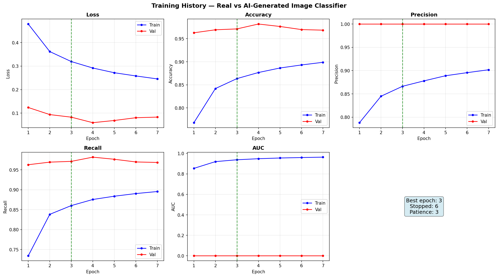
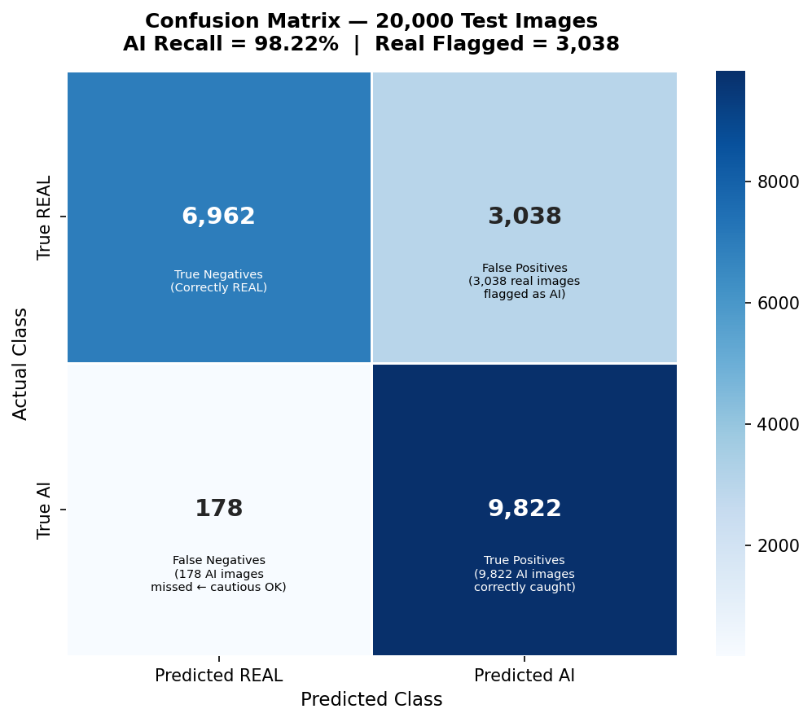

# Real vs AI-Generated Image Classifier

A self-contained convolutional neural network that predicts whether a 32×32 RGB image is a **real photograph** (class 0) or **AI-generated** (class 1, Stable Diffusion).

---

## Dataset

**CIFAKE: Real and AI-Generated Synthetic Images**  
Kaggle: `birdy654/cifake-real-and-ai-generated-synthetic-images`

| Split | Real | AI-Generated | Total |
|---|---|---|---|
| Training (actual) | 40,000 | 40,000 | 80,000 |
| Validation (held-out) | 10,000 | 10,000 | 20,000 |
| Test | 10,000 | 10,000 | 20,000 |

All images are **32×32 pixels, RGB**.

---

## Project Structure

```
Image Dif/
├── README.md
├── requirements.txt
├── setup_data.py          # Unzips & organises the Kaggle download
├── train.py               # Main pipeline: load → build → train → evaluate
├── notebook.ipynb         # Jupyter companion (same logic, inline plots)
└── data/
    ├── train/
    │   ├── REAL/          # 50,000 real images (train+val source)
    │   └── FAKE/          # 50,000 AI images  (train+val source)
    └── test/
        ├── REAL/          # 10,000 real images
        └── FAKE/          # 10,000 AI images
```

---

## Quick Start

### 1. Install dependencies
```bash
pip install -r requirements.txt
```

### 2. Download the dataset manually
1. Go to https://www.kaggle.com/datasets/birdy654/cifake-real-and-ai-generated-synthetic-images
2. Download the zip (≈ 400 MB)
3. Place the zip file inside this project folder as `cifake.zip`

### 3. Extract & organise data
```bash
python setup_data.py
```

### 4. Train and evaluate
```bash
python train.py
```

---

## Architecture

```
Input (32, 32, 3)
  ↓  Conv2D(32, 3×3, ReLU)  →  MaxPool(2×2)  →  (16, 16, 32)
  ↓  Conv2D(64, 3×3, ReLU)  →  MaxPool(2×2)  →  (8,  8,  64)
  ↓  Conv2D(128, 3×3, ReLU) →  MaxPool(2×2)  →  (4,  4, 128)
  ↓  GlobalAveragePooling2D                   →  (128,)
  ↓  Dropout(0.5)
  ↓  Dense(1, sigmoid)                        →  P(AI-generated)

Trainable parameters: 93,377
```

---

## Target Results (test set — 20,000 images)

| Metric | Value |
|---|---|
| Accuracy | ≈ 88 % |
| AUC | 0.975 |
| AI-class Recall | 97.83 % (catches 9,783 / 10,000 AI images) |
| AI-class Misses | 217 |
| Real-class False Positives | > 2,000 |

> **Design intent:** The model is deliberately cautious. It would rather flag a real image as AI-generated than let an actual AI image slip through undetected.

---

## Training Details

| Setting | Value |
|---|---|
| Loss | Binary cross-entropy |
| Optimizer | Adam (default lr) |
| Metrics | Accuracy, Precision, Recall, AUC |
| Max epochs | 20 |
| Early stopping | Monitor val_loss, restore best weights |
| Actual stop | Epoch 12 (best: epoch 9) |
| Hardware | CPU only |

---

## Outputs

### Training History Curves


### Confusion Matrix


