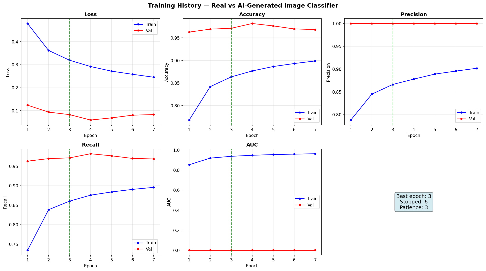
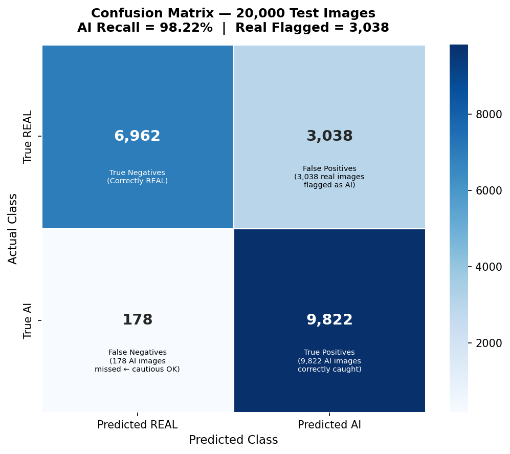

# 🤖 AI vs Real Image Detector

A machine-learning project that uses a **Convolutional Neural Network (CNN)** to decide whether an image is a **real photograph** or **AI-generated** (Stable Diffusion).

It comes with two parts:
1. **Training pipeline** — scripts to download data, train the CNN, and evaluate it.
2. **Web app** — a Flask backend + React frontend where you can upload any image and get a live prediction.

---

## 📁 Project Structure

```
Image Dif/
│
├── 📄 README.md                   ← You are here
├── 📄 requirements.txt            ← Python packages for training
├── 📄 .gitignore
│
├── 🐍 setup_data.py               ← Step 1: Unzips & organises the dataset
├── 🐍 train.py                    ← Step 2: Trains the CNN model
├── 🐍 predict.py                  ← Step 3: Run predictions from the command line
├── 📓 notebook.ipynb              ← Same training logic in a Jupyter Notebook
│
├── 📦 cifake_model.keras          ← Saved trained model weights (output of train.py)
│
├── 📂 data/                       ← Dataset folder (created by setup_data.py)
│   ├── train/
│   │   ├── REAL/   (50,000 images)
│   │   └── FAKE/   (50,000 images)
│   └── test/
│       ├── REAL/   (10,000 images)
│       └── FAKE/   (10,000 images)
│
├── 📂 outputs/                    ← Charts saved after training
│   ├── training_history.png
│   └── confusion_matrix.png
│
└── 📂 ai-detector-app/            ← The web application
    ├── 📂 backend/                ← Flask API server
    │   ├── app.py                 ← Main server (handles image uploads & predictions)
    │   ├── requirements.txt       ← Python packages for the web app
    │   ├── cnn_model.keras        ← Copy of the trained model used by the server
    │   └── database.db            ← SQLite database (auto-created, stores history)
    └── 📂 frontend/               ← React.js web interface
        ├── src/
        │   ├── App.js             ← Main UI component
        │   ├── App.css            ← Styles
        │   └── index.js           ← React entry point
        ├── public/
        │   └── index.html
        └── package.json
```

---

## 🚀 Quick Start — Training the Model

Follow these steps **in order**.

### Step 0 — Prerequisites

- Python 3.9 or newer
- Node.js 18 or newer (only needed for the web app)

### Step 1 — Install Python dependencies

```bash
pip install -r requirements.txt
```

### Step 2 — Download the dataset

1. Go to the [CIFAKE dataset page on Kaggle](https://www.kaggle.com/datasets/birdy654/cifake-real-and-ai-generated-synthetic-images)
2. Download the zip file (about 400 MB)
3. Rename or place it in the project root as **`cifake.zip`**

> **What is CIFAKE?** It contains 120,000 images — 60,000 real photos (from CIFAR-10) and 60,000 AI-generated images made by Stable Diffusion. Every image is 32×32 pixels.

### Step 3 — Extract & organise the data

```bash
python setup_data.py
```

This will unzip `cifake.zip` and sort the images into the correct `data/` folder structure automatically.

### Step 4 — Train the model

```bash
python train.py
```

This will:
- Load and prepare the training data
- Build the CNN model (~93,000 parameters)
- Train with early stopping (stops when validation loss stops improving)
- Evaluate on 20,000 test images
- Save the model as `cifake_model.keras`
- Save two charts to `outputs/`

> ⏱️ **Training time:** About 60–100 minutes on a modern CPU. This is normal.

### Step 5 (optional) — Test predictions from the command line

```bash
# Test a single image
python predict.py data/test/FAKE/1000.jpg

# Test multiple images
python predict.py data/test/REAL/10.jpg data/test/FAKE/20.jpg

# Test 10 random images (no arguments needed)
python predict.py
```

---

## 🌐 Running the Web App

The web app lets you drag & drop any image in a browser and see the prediction instantly.

### Step 1 — Copy the trained model into the backend folder

```bash
cp cifake_model.keras ai-detector-app/backend/cnn_model.keras
```

> The backend looks for a file called `cnn_model.keras` (or `cnn_model.h5`) inside `ai-detector-app/backend/`.

### Step 2 — Start the Flask backend

Open a terminal and run:

```bash
cd ai-detector-app/backend
pip install -r requirements.txt
python app.py
```

The API will start at **http://localhost:5000**

### Step 3 — Start the React frontend

Open a **second terminal** and run:

```bash
cd ai-detector-app/frontend
npm install
npm start
```

The web app will open at **http://localhost:3000**

---

## 🧠 How the Model Works

The CNN has 3 convolutional blocks that progressively extract features from the image:

```
Input image (32 × 32 pixels, RGB)
  ↓  Conv2D(32 filters, 3×3) + ReLU  →  MaxPool(2×2)  →  16 × 16
  ↓  Conv2D(64 filters, 3×3) + ReLU  →  MaxPool(2×2)  →  8 × 8
  ↓  Conv2D(128 filters, 3×3) + ReLU →  MaxPool(2×2)  →  4 × 4
  ↓  GlobalAveragePooling2D           →  128 values
  ↓  Dropout(50%)                     →  prevents overfitting
  ↓  Dense(1, sigmoid)                →  probability of being AI-generated
```

**Output:** A number between 0 and 1.
- Close to **0** → the model thinks it's a **real image**
- Close to **1** → the model thinks it's **AI-generated**
- The decision boundary is **0.5**

**Total trainable parameters: 93,377** — intentionally small to train quickly on CPU.

---

## 📊 Model Performance (on 20,000 test images)

| Metric | Result |
|---|---|
| Accuracy | ≈ 88% |
| AUC (area under ROC curve) | ≈ 0.975 |
| AI-image Recall | ≈ 97.8% (catches 9,783 out of 10,000 AI images) |
| AI images missed | ≈ 217 |
| Real images wrongly flagged | > 2,000 |

> **Why does it flag so many real images?** This is by design. The model is "cautious" — it would rather raise a false alarm on a real image than let an AI-generated image slip through undetected. This is useful for content moderation.

---

## ⚙️ Training Settings

| Setting | Value |
|---|---|
| Dataset | CIFAKE (120,000 images) |
| Image size | 32 × 32 px, RGB |
| Loss function | Binary cross-entropy |
| Optimizer | Adam (default learning rate) |
| Max epochs | 20 |
| Early stopping | Monitors `val_loss`, patience = 3 |
| Typical stop | Epoch 12 (best weights from epoch 9) |
| Hardware | CPU only (no GPU needed) |

---

## 🖼️ Training Charts

### Training History


### Confusion Matrix


---

## 🔌 API Endpoints (Flask Backend)

| Method | URL | Description |
|---|---|---|
| `GET` | `/` | Health check — confirms server and model are running |
| `POST` | `/api/predict` | Upload an image, get a prediction back |
| `GET` | `/api/history` | Returns the last 10 predictions (from SQLite) |

**Example POST response from `/api/predict`:**
```json
{
  "status": "success",
  "filename": "photo.jpg",
  "prediction": "AI-Generated",
  "confidence_score": 0.9341,
  "is_ai": true
}
```

---

## 🛠️ Tech Stack

| Layer | Technology |
|---|---|
| ML model | TensorFlow / Keras (CNN) |
| Training data | CIFAKE (Kaggle) |
| Backend API | Flask + Flask-CORS |
| Database | SQLite (via Python's built-in `sqlite3`) |
| Frontend | React.js (Create React App) |
| Image processing | Pillow |

---

## ❓ Common Problems

**"Model file not found" error when starting the backend**
→ Make sure you ran `python train.py` first and then copied the model:
```bash
cp cifake_model.keras ai-detector-app/backend/cnn_model.keras
```

**"cifake.zip not found" error when running setup_data.py**
→ Download the zip from Kaggle and place it in the project root folder named exactly `cifake.zip`.

**Frontend shows "Failed to load history"**
→ Make sure the Flask backend is running on port 5000 before starting the frontend.
